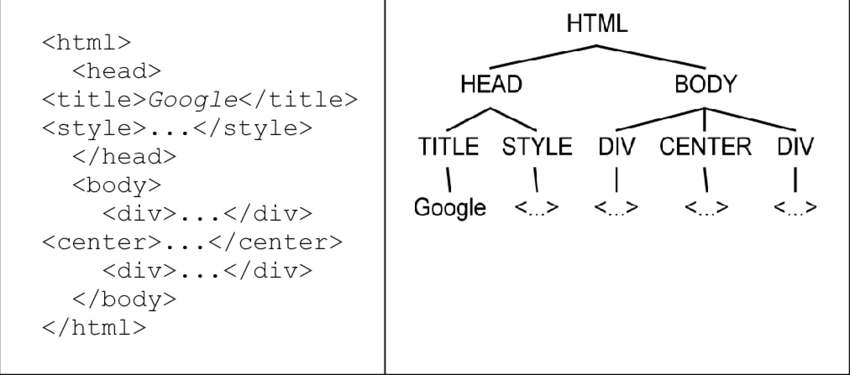

# HTML and CSS

**Learning objectives:**

- How to define the **structure** of a web page.
- How to define the **look/style** of a web page.

## Formatting

\

- Syntax for HTML elements:
    1. `<tagname>content</tagname>`
    1. `<tagname attributes/>` (*void element*)

\

- The document's elements must form a 
[**tree**](https://en.wikipedia.org/wiki/Tree_(graph_theory)) structure:
    1. Elements must be *strictly nested*.
    1. Valid HTML code: `<X><Y></Y></X>`
    1. Non-valid HTML code: `<X><Y></X></Y>`

## Example {-}

\   
\

```{r, echo=FALSE}
#| out.width: 750px
#| fig.align: center
#| fig.cap: "Basic HTML structure"

```

## Text

- Some characters (such as `&lt;` and `&gt;`) require a special syntax,
due to their use being reserved for a specific use.
- **Escape sequences** are used in order to represent such characters.

Name | Escape Sequence | Character
|:---:|:---:|:---:|
Less than	| `&lt;` |	&lt;
Greater than	| `&gt;` |	&gt;
Ampersand	| `&amp;` |	&amp;
Copyright	| `&copy;` |	&copy;
Plus/minus	| `&plusmn;` |	&plusmn;
Micro	| `&micro;` |	&micro;

## Pages

- Any HTML page should have:
    - A *single* `html` element that **encloses everything** else.
    - A *single* `head` element for including the page's **metadata**
    and **dependencies**.
    - A *single* `body` element that consists of the content to be **displayed**.

- Indentation does **not** matter for the HTML code, 
but ... keep it clean please (human-readable).

- Basic HTML structure:

    ```html
    <html>
      <head>
        <!-- description of page goes here -->
      </head>
      <body>
        <!-- content of page goes here -->
      </body>
    </html>
    ```

## Example {-}

- What does this code generate?

    ```html
    <html>
      <head>
        <title>This text is displayed in the browser bar</title>
      </head>
      <body>
        <h1>Displayed Content Starts Here</h1>
        <p>
          This course introduces core features of <em>JavaScript</em>
          and shows where and how to use them.
        </p>
      </body>
    </html>
    ```

- [Why](https://stackoverflow.com/questions/271743/whats-the-difference-between-b-and-strong-i-and-em#answer-271773)
the use of `em` and `strong` is preferred, respectively, over `i` and `b`.

## Attributes 

\

- HTML elements can be customized via **attributes**. 
- These are included inside the *opening tag* and have the form `name="value"`.

\

- Examples:
    - <code title="Text when hovered">&lt;h1 title='Text when hovered'&gt;First header&lt;/h1&gt;</code>
    - `<p class="disclaimer">CSS spoiler</p>`
    - [`<canvas data-anything="alsoAnything"></canvas>`](https://developer.mozilla.org/en-US/docs/Learn/HTML/Howto/Use_data_attributes)

\

- Every specific attribute should appear **only once** in an opening tag.

## Lists

- **Unordered** list

    ```html
    <ul>
      <li>a</li>
      <li>b</li>
      <li>c</li>
    </ul>
    ```

- **Ordered** list

    ```html
    <ol>
      <li>first</li>
      <li>second</li>
      <li>third</li>
    </ol>
    ```

- **Nested** lists

    ```html
    <ol>
      <li>Good animes
        <ol>
          <li>Steins; Gate</li>
          <li>Shingeki no Kyojin</li>
        </ol>
      </li>
      <li>Bad animes
        <ol>
          <li>none</li>
          <li>don't judge taste</li>
        </ol>
      </li>
    </ol>
    ```

## Tables

- Basic table [structure](https://developer.mozilla.org/en-US/docs/Web/HTML/Element/table).

- Example:

    ```html
    <table>
      <thead>
        <tr><th>The table header</th></tr>
      </thead>
      <tbody>
        <tr>
          <td>The table body</td>
          <td>with two columns</td>
        </tr>
      </tbody>
    </table>
    ```

## Links

\

- The HTML element to create a link is 
`a` (an [anchor](https://developer.mozilla.org/en-US/docs/Web/HTML/Element/a)).

- The anchor's `href` attribute specifies what the link is pointing,
whether a local file or an URL.

- Why are links called anchors though?
    - <https://www.quora.com/Why-are-they-called-anchor-tags/answer/Daniel-Walker?ch=10&oid=4241141&share=1e835c47&srid=uu0xa&target_type=answer>
    - <https://www.quora.com/Why-are-they-called-anchor-tags/answer/Adam-Gering?ch=10&oid=4241266&share=97368af3&srid=uu0xa&target_type=answer>

\

- Anchors are [too powerful](https://developer.mozilla.org/en-US/docs/Web/HTML/Element/a#using_the_download_attribute_to_save_a_canvas_as_a_png).

## Images

\

- Images can be **stored inside** HTML pages: 
  - Using the `svg` element (to be explored in chapter [8](https://third-bit.com/js4ds/#s:vis)).
  - **Encoding** the image as text and including that text inside `<body>`.

\

- Images stored *outside* the HTML page can be accessed using `img`:
    - Example: ``

\

- The image's `src` attribute can be an URL, or, a local or global path.

## Cascading Style Sheets

\

- Cascading Style Sheets (**CSS**) is how the **style**/looks of a page is declared.

- CSS is not a programming language, neither a markup language ... 
it's a [style sheet language](https://www.scaler.com/topics/is-css-a-programming-language/) 
that defines the **presentation** of another markup language, like HTML.

- That does not mean that CSS is an easy language ... it can get quite 
[complex](https://codepen.io/collection/AKkZro).

- [Why](https://stackoverflow.com/a/1043046) **cascading** though?

## External style sheet {-}

\

- It's recommended that the styles to be applied to a page
are included in a separate file (like `.css` type) and then 
*reference* it into the page, as follows:
    - `<link rel="stylesheet" href="styles.css"/>`

\

- Basic syntax:

    ```css
    elementToModify {
      propertyName: propertyValue;
      propertyName: propertyValue;
    }
    ```

## Example {-}

In this web page example, 
we use some of the most common
CSS tools used in modern websites.

Try to play around with the CSS code
in order to understand what it is doing.

```html
<html>
    <head>
      <link rel="stylesheet" href="./styles.css">
    </head>
    <body>
      <h1>Press any cell</h1>
      <table>
        <tr class="odd-row">
          <td>1</td>
          <td>2</td>
          <td>3</td>
        </tr>
        <tr class="even-row">
          <td>4</td>
          <td>5</td>
          <td>6</td>
        </tr>
        <tr class="odd-row" id="last-row">
          <td>7</td>
          <td>8</td>
          <td>9</td>
        </tr>
      </table>
    </body>
</html>
```

Code for the `styles.css` file:

```css
/* Center content */
body {
  margin: 0;
  padding: 2.5em 0 0 0;
  display: flex;
  align-items: center;
  flex-direction: column;
  gap: 3em;
}

/* Main title */
h1 {
  margin: 0;
  text-decoration: underline;
}

/* Basic table styling */
table {
  border-collapse: collapse;
}
td {
  cursor: pointer;
  padding: 1em;
  font-size: 3em;
  text-align: center;
  border: 2px solid black;
}

/* 
  CSS specificity examples 
  https://developer.mozilla.org/en-US/docs/Web/CSS/Specificity
*/
.odd-row td {
  transform: rotate(180deg);
}
.even-row td {
  transform: scaleX(-1);
}
#last-row td {
  transform: none;
}

/* When mouse is on top of element */
td:hover {
  background-color: crimson;
}

/* Simulate "when clicked" */
td:active {
  transform: none;
  color: white;
  background-color: black;
  transition: color 500ms;
}
td:active::after {
  content: " was clicked!";
}

/* For cells "not clicked" */
table:has(td:active) td:not(:active) {
  filter: blur(2.5px);
  background-color: gold;
  transition: background-color 350ms;
}
```

## Bootstrap

\

Instead of defining ourselves the stylings for a 
page, we can ~~steal~~ import CSS declarations 
from some library or [framework](https://www.baeldung.com/cs/framework-vs-library#:~:text=A%20framework%20is%20used%20for,the%20functionality%20of%20an%20application.).

- [Bootstrap](https://getbootstrap.com/docs/5.3/getting-started/introduction/)
is a popular framework for styling web pages.

- Bootstrap was created at [Twitter](https://en.wikipedia.org/wiki/Doge_%28meme%29) in mid-2010.

## Example {-}

The Bootstrap example from the book has a typo.
Use the following code instead:

```html
<html>
  <head>
    <link 
      rel="stylesheet"
      href="https://stackpath.bootstrapcdn.com/bootstrap/4.1.3/css/bootstrap.min.css"
    >
    <style>
      div {
        border: solid 1px;
      }
    </style>
  </head>
  <body>
    <div class="jumbotron text-center">
      <h1>Page Title</h1>
      <p>Resize this page to see the layout adjust dynamically.</p>
    </div>

    <div class="container">
      <div class="row">
        <div class="col-sm-4">
          <h2>First column is 4 wide</h2>
          <p>Text here goes</p>
          <p>in the column</p>
        </div>
        <div class="col-sm-8">
          <h2>Second column is 8 wide</h2>
          <p>Text over here goes</p>
          <p>in the other column</p>
        </div>
      </div>
    </div>
  </body>
</html>
```

## Exercises

## *Cutting Corners* {-}

1. The browser shows the content as if every
tag had been *closed* properly.

1. For both unclosed `ul` or `ol` tags, 
the browser renders the page as if those had 
elements had been properly closed.

1. Such behaviour **does** to be consitent for 
`p` and `li` tags as well.

## *Mix and Match* {-}

1. Code:

    ```html
      <html>
      <head>
        <style>
          /* Make table actually look like one */
          table { border-collapse: collapse }
          td { border: 1px solid black }

          ol { 
            /* 
              Consider the marker (bullet points)
              as part of the box of content defined
              by its items
            */
            list-style-position: inside;
            /* Remove indentation */
            padding-left: 0;
          }
        </style>
      </head>
      <body>
        <table>
          <tr>
            <td>
              <ol>
                <li>1</li>
                <li>2</li>
                <li>3</li>
              </ol>
            </td>
            <td>
              <ol>
                <li>4</li>
                <li>5</li>
                <li>6</li>
              </ol>
            </td>
          </tr>
          <tr>
            <td>
              <ol>
                <li>7</li>
                <li>8</li>
                <li>9</li>
              </ol>
            </td>
            <td>
              <ol>
                <li>10</li>
                <li>11</li>
                <li>12</li>
              </ol>
            </td>
          </tr>
        </table>
      </body>
    </html>
    ```

1. The **Microsoft Edge** browser does consistently displays the lists as **Google Chrome**.

1. <http://dowebsitesneedtolookexactlythesameineverybrowser.com/>
There are only [guidelines](https://www.w3.org/Help/#activity), but no specific standards for things like how a browser implements 
CSS rules into a website. **Why should there be?**

## *Naming* {-}

1. For Bootstrap, `sm` stand for a kind of [breakpoint](https://getbootstrap.com/docs/5.0/layout/breakpoints/). 
Such breakpoint allows for specific CSS rules when the device's width is greater than 575 pixels. 
Example page:

    ```html
    <html>
      <head>
        <link 
          rel="stylesheet"
          href="https://stackpath.bootstrapcdn.com/bootstrap/4.1.3/css/bootstrap.min.css"
        >
        <style>
          div { 
            color: white;
            border: 1px solid gold;
            background-color: crimson; 
          }
        </style>
      </head>
      <body>
        <!-- https://getbootstrap.com/docs/4.0/layout/grid/ -->
        <div class="row">
          <!-- Full width by default, but only half width for sm breakpoint -->
          <div class="col-12 col-sm-6">col-12 col-sm-6</div>
          <!-- Half width by default; 4/12 for sm breakpoint -->
          <div class="col-6 col-sm-4">.col-6 .col-sm-4</div>
          <!-- Half width by default; 8/12 for sm breakpoint -->
          <div class="col-6 col-sm-8">.col-6 .col-sm-8</div>
        </div>
      </body>
    </html>
    ```

1. For more options, check <https://getbootstrap.com/docs/5.0/layout/breakpoints/>.

1. The Fortran language doesn't seem to have been used much 
for web development, but, the syntax used by Bootstrap's **classes**, 
for example `col-sm-4`, goes in line with the use of
[kebab case](https://www.codingem.com/what-is-kebab-case/) for certain aspects of web development.

## *Color* {-}

```html
<html>
  <head>
    <style>
      body {
        height: 90vh;
        display: grid;
        place-content: center;
      }
      p {
        font-size: 30em;
      }
    </style>
  </head>
  <body>
    <p>color</p>
    <script>
      // Generate 100 random colors
      const randomColors = [];
      for (let i=0; i<100; i++) {
        // Get random integers between 0 and 255
        const r = Math.floor(Math.random() * 256);
        const g = Math.floor(Math.random() * 256);
        const b = Math.floor(Math.random() * 256);

        // Push string with random RGB values
        randomColors.push(`${r}, ${g}, ${b}`);
      }

      const word = document.querySelector("p");

      function changeColor() {
        // Get random integers between 0 and 99
        const randomIndex = Math.floor(Math.random() * 100);
        // Change color of word
        word.style.color = 
          "rgb(" + randomColors[randomIndex] + ")";
      }

      // Repeat every 250 miliseconds
      setInterval(changeColor, 250);
    </script>
  </body>
</html>
```

## *Units* {-}

1. Possible [values](https://developer.mozilla.org/en-US/docs/Web/CSS/font-size) for text size in CSS. 

1. When we got down with it ... *anything* means nothing ...
  there is no universal truths in the universe ... or is such
  fact the one universal truth for us not to lose touch with reality?

## Meeting Videos {-}

### Cohort 1 {-}

`r knitr::include_url("https://www.youtube.com/embed/N9aEMSjCzBk")`

<details>
<summary> Meeting chat log </summary>

```
00:28:34	Lucio Cornejo:	https://developer.mozilla.org/en-US/docs/Web/HTML/Element/a#examples
00:33:26	Lucio Cornejo:	https://d3js.org/
00:55:57	James Arthur Shaw:	Here's also the URL of a non-minified version: https://stackpath.bootstrapcdn.com/bootstrap/4.1.3/css/bootstrap.css
00:59:29	Lucio Cornejo:	https://www.w3schools.com/html/html_responsive.asp
01:06:22	Lucio Cornejo:	shiny UI
01:06:41	Lucio Cornejo:	outstanding user interfaces for shiny bookclub r4ds
```
</details>
